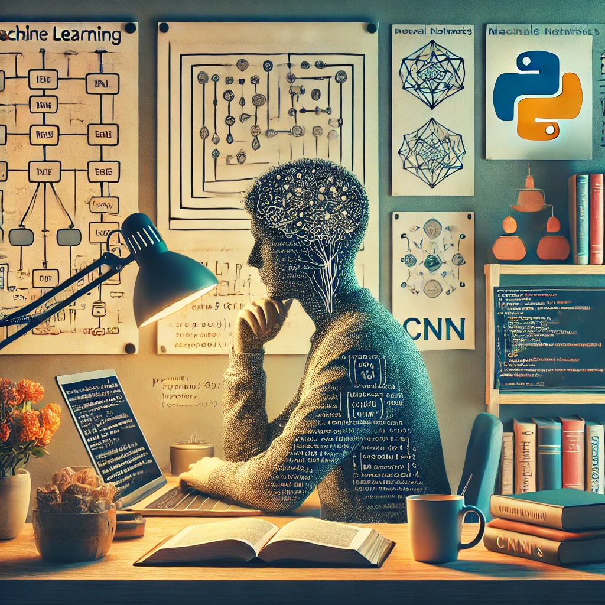

<h1 align="center">👋 Hello, I'm Nima!</h1>

  <em>Artificial Intelligence Specialist | Software Developer | Machine Learning Enthusiast</em>

---

### 👨‍💻 About Me
I am an **Artificial Intelligence Specialist** and **Software Developer** with a passion for innovation, solving complex challenges, and building impactful solutions. With a solid academic background and hands-on experience, I bring a unique blend of research and development skills to the world of AI and software engineering.

---

### 🌟 Highlights About Me
- 🎓 **Master’s in Computer Science** (University of Padua): My thesis focused on uncovering vulnerabilities in **Large Language Models (LLMs)** through poisoned vector databases in **Retrieval-Augmented Generation (RAG)** systems.
- 🔬 **AI Researcher**: Investigated AI security, backdoor attacks, and data poisoning during my internship at Radboud University.
- 💻 **Software Developer**: Built full-stack applications and machine learning models that drive real-world results, including a second-hand car price prediction system and diabetic retinopathy detection.

---

### 🌟 Areas of Interest
- **Machine Learning & Deep Learning**: Crafting intelligent models for real-world applications.
- **Large Language Models (LLMs)**: Enhancing language-based AI systems with optimized performance.
- **AI & LLM Vulnerabilities**: Pioneering secure and robust AI systems.
- **Data-Driven Application Development**: Harnessing insights to build impactful software solutions.
- **Software Development**: Delivering scalable, efficient, and user-friendly applications.

---

### 🛠️ Skills & Technologies

#### **Programming Languages**

  
  
  

#### **Frameworks & Libraries**

  
  
  
  

#### **Tools & Technologies**

  
  
  
  

#### **Data Analysis**

  
  
  

#### **Programming Languages**

  
  
  

#### **Frameworks & Libraries**

  
  
  
  

#### **Tools & Technologies**

  
  
  
  

#### **Data Analysis**

  
  
  

---

### 🚀 Recent Projects
- **Diabetic Retinopathy Detection**: Developed a CNN-based model using **Inception V3** to classify the severity of diabetic retinopathy, achieving high accuracy through advanced preprocessing techniques.
- **LLM Optimization in Healthcare**: Fine-tuned **Mistral 7B** to improve question-answering systems in the medical domain, ensuring more accurate and relevant responses.

---

### 🤝 Let’s Connect!
I’m always excited to collaborate on innovative projects or discuss emerging trends in AI and software development. Feel free to reach out or explore my work:

- **[LinkedIn](https://linkedin.com/in/nima-daryabar)**
- **[GitHub](https://github.com/nimad70)**

---

<em>"Curiosity drives my work, and innovation fuels my passion. Let's build something extraordinary together!"</em>

<!---<h1 align="center">👋 Hello, I'm Nima!</h1>

  <em>Artificial Intelligence Specialist | Software Developer | Machine Learning Enthusiast</em>

---

### 👨‍💻 About Me
I am an **AI enthusiast** and **Software Developer** passionate about tackling complex challenges through code and innovation. With a Master’s degree in Computer Science from the **University of Padua**, I’ve specialized in **AI security** and **machine learning**. My research focused on uncovering vulnerabilities in Large Language Models (LLMs) through poisoned vector databases in Retrieval-Augmented Generation (RAG)--based systems. Beyond research, I’ve worked on impactful projects across machine learning, data analysis, and full-stack development, always striving to blend creativity with cutting-edge technology.

---

  

  <em>That's me in my natural habitat: surrounded by neural networks, Python, and a big cup of coffee! ☕</em>

---

### 🌟 Professional Interests
- **Machine Learning & Deep Learning**: Crafting models that drive intelligent solutions.
- **Large Language Models**: Enhancing language-based systems to deliver powerful, contextual responses.
- **AI & LLM Vulnerabilities**: Ensuring secure and robust AI systems by addressing critical vulnerabilities.
- **Data-Driven Application Development**: Building impactful applications powered by actionable insights.
- **Software Development**: Developing scalable and efficient software solutions that meet diverse user needs.

---

### 🛠️ Skills & Technologies

  <table>
    <tr>
      <td align="center" width="150">
        
      </td>
      <td align="center" width="150">
        
      </td>
      <td align="center" width="150">
        
      </td>
    </tr>
    <tr>
      <td align="center" width="150">
        
      </td>
      <td align="center" width="150">
        
      </td>
      <td align="center" width="150">
        
      </td>
    </tr>
    <tr>
      <td align="center" width="150">
        
      </td>
      <td align="center" width="150">
        
      </td>
      <td align="center" width="150">
        
      </td>
    </tr>
    <tr>
      <td align="center" width="150">
        
      </td>
      <td align="center" width="150">
        
      </td>
      <td align="center" width="150">
        
      </td>
    </tr>
  </table>

### 🛠️ Skills & Technologies

#### 🖥️ Programming Languages
- **Python** 🐍
- **C++** 🚀
- **SQL** 🗄️

#### 📚 Frameworks & Libraries
- **TensorFlow** 🔶
- **PyTorch** 🔥
- **Scikit-learn** 📊
- **Keras** 📈

#### 🛠 Tools & Technologies
- **Git** 🧑‍💻
- **Docker** 🐳
- **LaTeX** ✍️
- **Azure** ☁️

#### 📊 Data Analysis
- **Pandas** 🐼
- **NumPy** 🔢
- **MATLAB** 📐

### 🛠️ Skills & Technologies

<table>
  <tr>
    <td align="center" width="96">
      
       <b>Python</b>
    </td>
    <td align="center" width="96">
      
       <b>C++</b>
    </td>
    <td align="center" width="96">
      
       <b>SQL</b>
    </td>
    <td align="center" width="96">
      
       <b>TensorFlow</b>
    </td>
  </tr>
  <tr>
    <td align="center" width="96">
      
       <b>PyTorch</b>
    </td>
    <td align="center" width="96">
      
       <b>Docker</b>
    </td>
    <td align="center" width="96">
      
       <b>LaTeX</b>
    </td>
    <td align="center" width="96">
      
       <b>Azure</b>
    </td>
  </tr>
</table>

### 🛠️ Skills & Technologies

  
  
  
  
  
  
  
  

<b>Languages:</b> Python, C++, SQL  
<b>Frameworks:</b> TensorFlow, PyTorch  
<b>Tools:</b> Docker, LaTeX, Azure

---

### 🚀 Recent Projects

- **Diabetic Retinopathy Detection**: Developed a model using **Inception V3 CNN** to classify diabetic retinopathy severity based on retina images, implementing preprocessing techniques to enhance accuracy.
  
- **LLM Optimization in Healthcare**: Fine-tuned a **Mistral 7B model** to improve domain-specific question-answering systems in the medical field, achieving better accuracy and relevance for inquiries.

---

### 🤝 Let's Connect!

  <a href="https://linkedin.com/in/nima-daryabar" target="_blank"><strong>LinkedIn</strong></a> | 
  <a href="https://github.com/nimad70" target="_blank"><strong>GitHub</strong></a>

---

<em>"Innovation lies at the intersection of curiosity and dedication. Let's shape the future of technology together!"</em>

<!---<h1 align="center">👋 Hello, I'm Nima! 👋</h1>

  <em>Artificial Intelligence Specialist | Software Developer | Machine Learning Enthusiast</em>

---

### 👨‍💻 About Me
I'm a passionate **AI enthusiast** and **Software Developer** with a love for tackling complex problems through code. I hold a Master’s degree in Computer Science from the **University of Padua**, where I focused my research on **AI security** and **machine learning**. My thesis explored vulnerabilities in Large Language Models (LLMs) through poisoned vector databases in RAG-based systems, and I've since worked on projects across machine learning, data analysis, and full-stack development.

---

  

  <em>That's me in my natural habitat: surrounded by neural networks, Python, and a big cup of coffee! ☕</em>

---

### 🌟 Areas of Interest
- Machine Learning & Deep Learning
- AI Security & LLM Vulnerabilities
- Data-Driven Application Development
- Full-Stack Development

---

### 🛠️ Skills & Technologies

#### 🖥️ Programming Languages
- **Python** 🐍
- **C++** 🚀
- **SQL** 🗄️

#### 📚 Frameworks & Libraries
- **TensorFlow** 🔶
- **PyTorch** 🔥
- **Scikit-learn** 📊
- **Keras** 📈

#### 🛠 Tools & Technologies
- **Git** 🧑‍💻
- **Docker** 🐳
- **LaTeX** ✍️
- **Azure** ☁️

#### 📊 Data Analysis
- **Pandas** 🐼
- **NumPy** 🔢
- **MATLAB** 📐

---

### 🚀 Recent Projects

- **Diabetic Retinopathy Detection**: Developed a model using **Inception V3 CNN** to classify diabetic retinopathy severity based on retina images, enhancing accuracy through preprocessing techniques.
  
- **LLM Optimization in Healthcare**: Fine-tuned a **Mistral 7B model** to improve question-answering systems in the medical field, achieving better accuracy and relevance for domain-specific inquiries.

---

### 🤝 Let's Connect!
- **LinkedIn**: [nima-daryabar](https://linkedin.com/in/nima-daryabar)
- **GitHub**: [nimad70](https://github.com/nimad70)

---

<em>"Curiosity drives my work, and innovation fuels my passion. Let's collaborate and build something amazing!"</em>

<!---<h1 align="center">👋 Hello, I'm Nima!</h1>

  <em>Artificial Intelligence Specialist | Software Developer | Machine Learning Enthusiast</em>

---

### 👨‍💻 About Me
I'm a passionate **AI enthusiast** and **Software Developer** with a love for tackling complex problems through code. I hold a Master’s degree in Computer Science from the **University of Padua**, where I focused my research on **AI security** and **machine learning**. My thesis explored vulnerabilities in Large Language Models (LLMs) through poisoned vector databases in RAG-based systems, and I've since worked on projects across machine learning, data analysis, and full-stack development.

---

### 🌟 Areas of Interest
- **Machine Learning & Deep Learning**
- **Large Language Models**
- **AI & LLM Vulnerabilities**
- **Data-Driven Application Development**
- **Software Development**

---

### 🛠️ Skills & Technologies

#### 🖥️ Programming Languages
- **Python** 🐍
- **C++** 🚀
- **SQL** 🗄️

#### 📚 Frameworks & Libraries
- **TensorFlow** 🔶
- **PyTorch** 🔥
- **Scikit-learn** 📊
- **Keras** 📈

#### 🛠 Tools & Technologies
- **Git** 🧑‍💻
- **Docker** 🐳
- **LaTeX** ✍️
- **Azure** ☁️

#### 📊 Data Analysis
- **Pandas** 🐼
- **NumPy** 🔢
- **MATLAB** 📐

---

### 🚀 Recent Projects

- **Diabetic Retinopathy Detection**: Developed a model using **Inception V3 CNN** to classify diabetic retinopathy severity based on retina images, enhancing accuracy through preprocessing techniques.
  
- **LLM Optimization in Healthcare**: Fine-tuned a **Mistral 7B model** to improve question-answering systems in the medical field, achieving better accuracy and relevance for domain-specific inquiries.

---

### 🤝 Let's Connect!
- **LinkedIn**: [nima-daryabar](https://linkedin.com/in/nima-daryabar)
- **GitHub**: [nimad70](https://github.com/nimad70)

---

<em>"Curiosity drives my work, and innovation fuels my passion. Let's collaborate and build something amazing!"</em>

--->

<!---<h1 align="center">👋 Hello, I'm Nima! 👋</h1>

  <em>Artificial Intelligence Specialist | Software Developer | Machine Learning Enthusiast</em>

---

### 👨‍💻 About Me
I'm a passionate **AI enthusiast** and **Software Developer** with a love for tackling complex problems through code. I hold a Master’s degree in Computer Science from the **University of Padua**, where I focused my research on **AI security** and **machine learning**. My thesis explored vulnerabilities in Large Language Models (LLMs) through poisoned vector databases in RAG-based systems, and I've since worked on projects across machine learning, data analysis, and full-stack development.

---

### 🌟 Areas of Interest
- **Machine Learning & Deep Learning**
- **Large Language Models**
- **AI & LLM Vulnerabilities**
- **Data-Driven Application Development**
- **Software Development**

---

### 🛠️ Skills & Technologies

#### 🖥️ Programming Languages

  
  
  

#### 📚 Frameworks & Libraries

  
  
  
  

#### 🛠 Tools & Technologies

  
  
  
  

#### 📊 Data Analysis

  
  
  

---

### 🚀 Recent Projects

- **Diabetic Retinopathy Detection**: Developed a model using **Inception V3 CNN** to classify diabetic retinopathy severity based on retina images, enhancing accuracy through preprocessing techniques.
  
- **LLM Optimization in Healthcare**: Fine-tuned a **Mistral 7B model** to improve question-answering systems in the medical field, achieving better accuracy and relevance for domain-specific inquiries.

---

### 🤝 Let's Connect!

  
  

---

<em>"Curiosity drives my work, and innovation fuels my passion. Let's collaborate and build something amazing!"</em>

--->

<!---# 👋 Hello, I'm Nima!

I'm an **Artificial Intelligence enthusiast** and **Software Developer** with a passion for solving complex problems through code. With a Master's degree in Computer Science from the University of Padua, I've focused my academic journey on **AI security** and **machine learning** innovation. Recently, I worked on exposing vulnerabilities in Large Language Models (LLMs) using poisoned vector databases in RAG-based systems as part of my thesis. My journey has taken me from freelance projects to research internships, always driven by a love for pushing the boundaries of technology.

### 💡 My Interests:
- Machine Learning & Deep Learning
- AI & LLM Vulnerabilities
- Data-Driven Application Development
- Large Language Models

### 🛠 Skills:
#### Programming Languages:

#### Frameworks & Libraries:

#### Tools & Technologies:

#### Data Analysis:

### 🌟 Recent Projects:
- **Diabetic Retinopathy Detection**: Using **Inception V3 CNN**, I developed a model to classify the severity of diabetic retinopathy based on retina images.
- **LLM Optimization in Healthcare**: Fine-tuned a **Mistral 7B model** to improve question-answering systems in the medical field, enhancing accuracy and relevance.

### 🤝 Let's Connect!
- **[LinkedIn](https://linkedin.com/in/nima-daryabar)**
- **[GitHub](https://github.com/nimad70)**

*"Curiosity drives my work, and innovation fuels my passion. Let's collaborate and build something amazing!"*
--->

<!--

## Hi there 👋

**nimad70/nimad70** is a ✨ _special_ ✨ repository because its `README.md` (this file) appears on your GitHub profile.

Here are some ideas to get you started:

- 🔭 I’m currently working on ...
- 🌱 I’m currently learning ...
- 👯 I’m looking to collaborate on ...
- 🤔 I’m looking for help with ...
- 💬 Ask me about ...
- 📫 How to reach me: ...
- 😄 Pronouns: ...
- ⚡ Fun fact: ...
-->
